## Raytracing c++
This repository contains the source code to render objects using raytracing

<!--  -->
<p align="center">
  
</p>

## Examples of different integrators

In the first part of the tuto, I have implemented the following integrators:

| Flat | Normals | Direct | Whitted |
|:-------------------------:|:-------------------------:|:-------------------------:|:-------------------------:
|  | 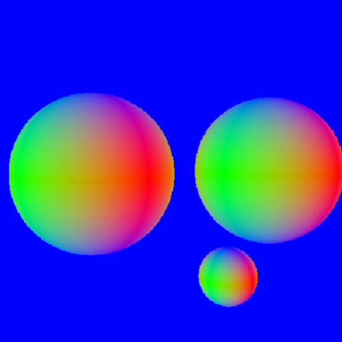 | 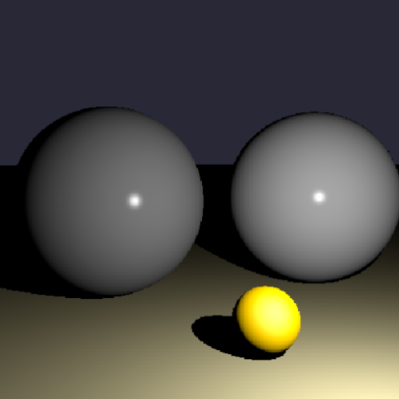 | 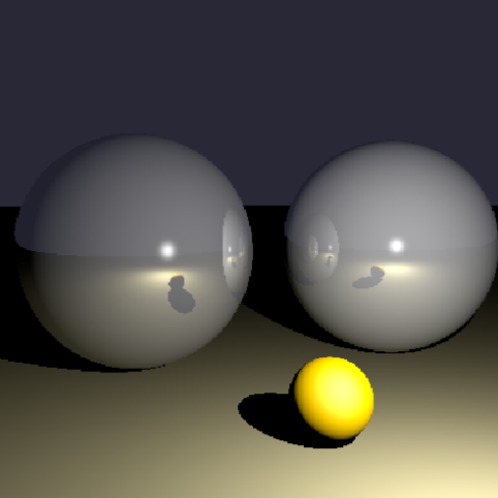 |
| 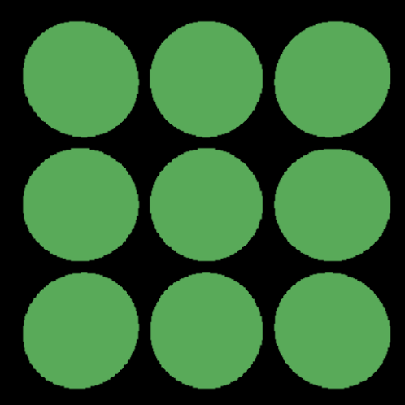 | 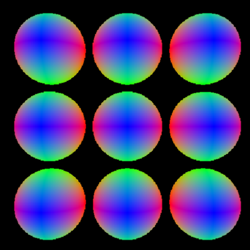 | 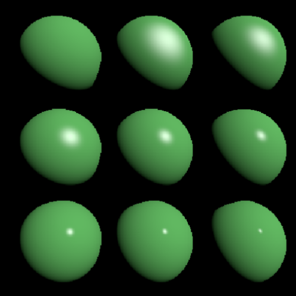 | 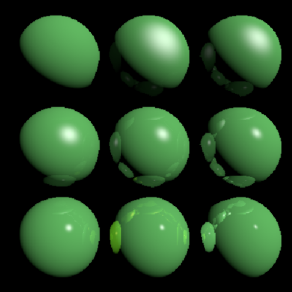 |
| 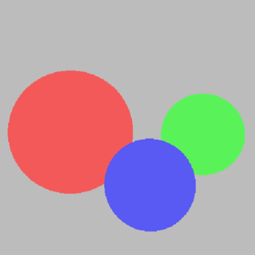 | 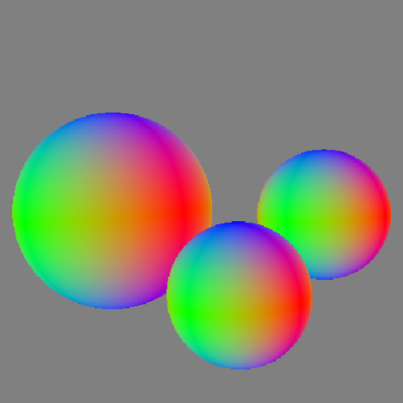 | 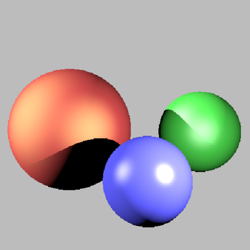 |  |
| 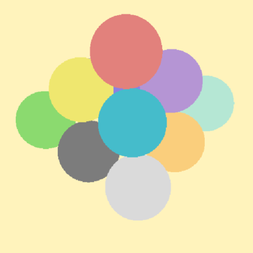 | 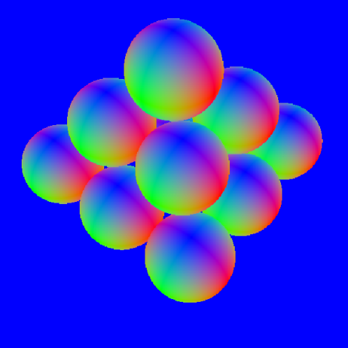 |  | 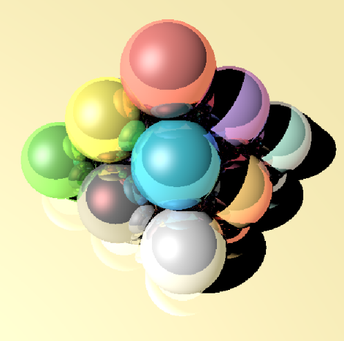 |

## Rendering Mesh

* BVH : When using BVH the time gains very remarkable (from 60s to 1s)

| Face Normals | Barycentriques Normals | Increasing Mesh Resolution |
|:-------------------------:|:-------------------------:|:-------------------------:|
|  | 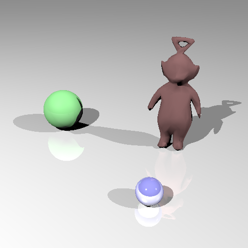 |  |


### Textures
| Petanque | Terre & Lune | Deux Plans | Tas Spheres |
|:-------------------------:|:-------------------------:|:-------------------------:|:-------------------------:|
| 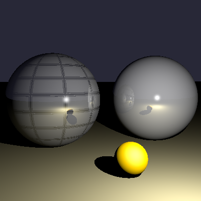 | 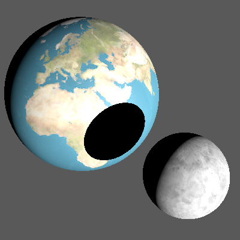 | 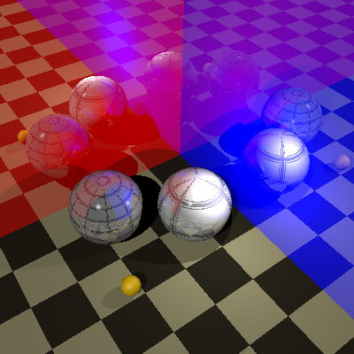 | 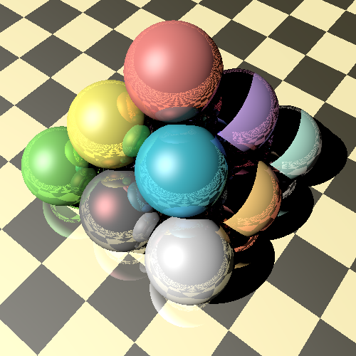 |

### Rednering killeroo

There is a bug when trying to render killeroo.

| Killeroo | Killeroo Glass |
|:-------------------------:|:-------------------------:|
| 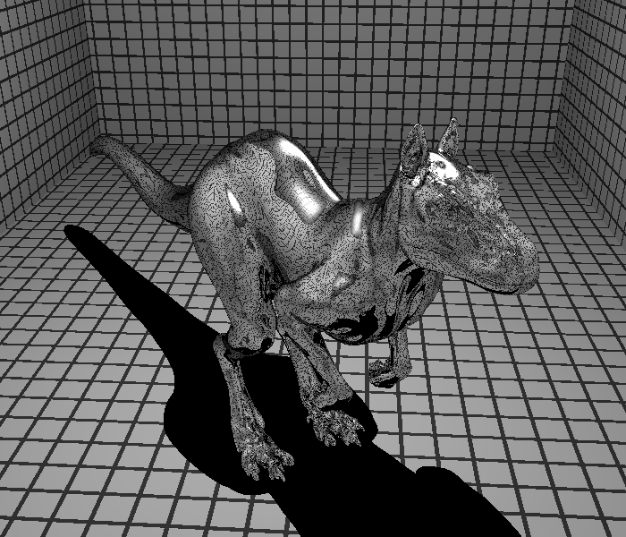 | 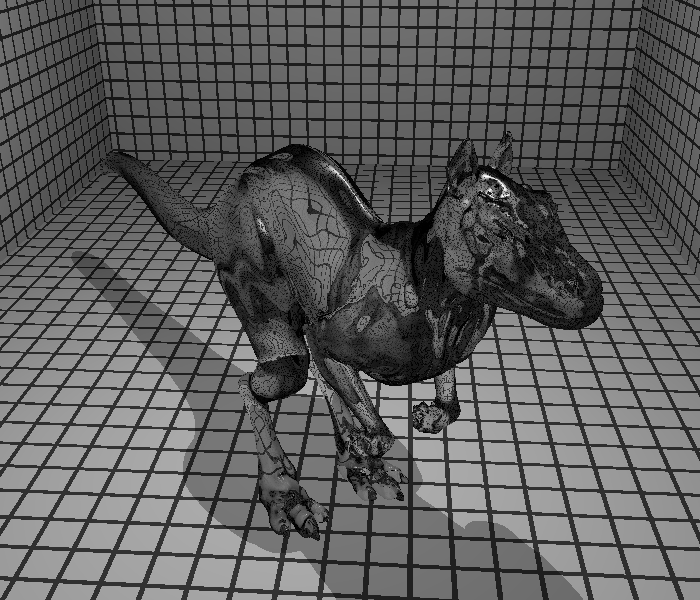 |


## Building and running the project

Build by making a build directory (i.e. `build/`), run `cmake` in that dir, and then use `make` to build the desired target.

#### First compilation:
  
``` bash
> mkdir build
> cd build
> cmake ../ray_tracing
> make -j6
```

#### Recompile:

``` bash
> cmake ../ray_tracing -DCMAKE_BUILD_TYPE=Debug
```

#### Run:

``` bash
> ./m3d_raytracer ../m3d_td1/data/troisSpheres.scn
```

## References
https://www.labri.fr/perso/pbenard/teaching/mondes3d/
